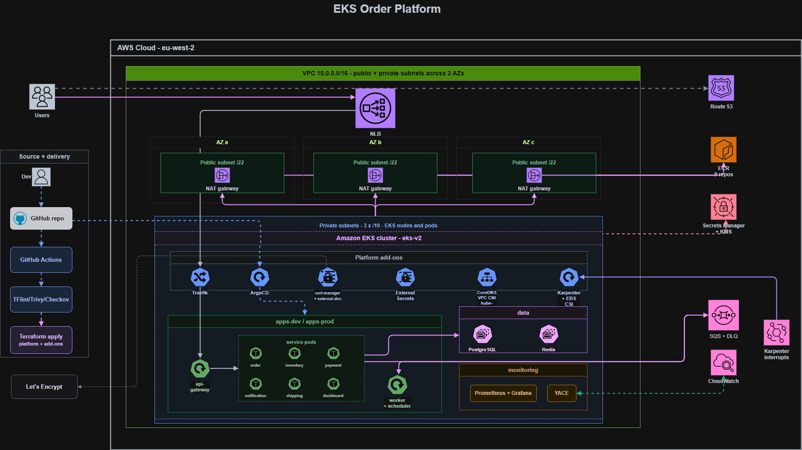
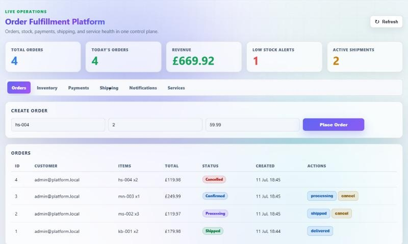
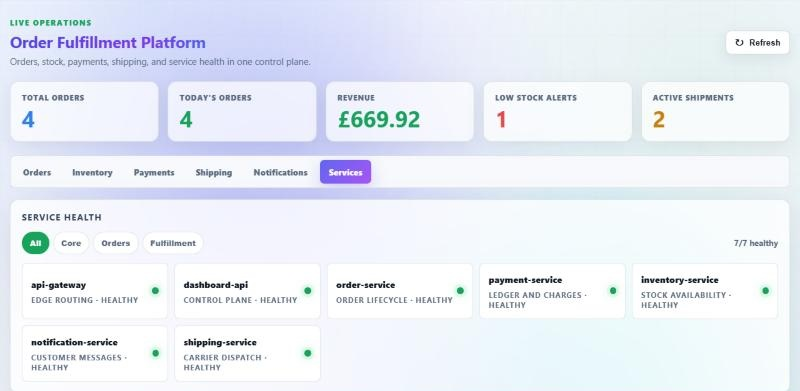
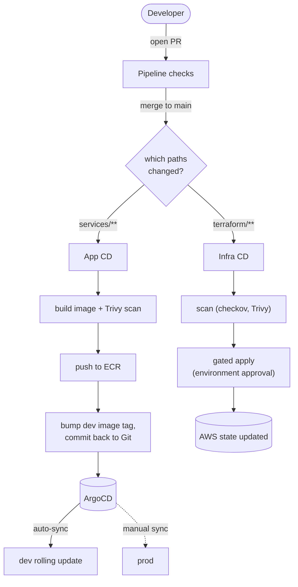
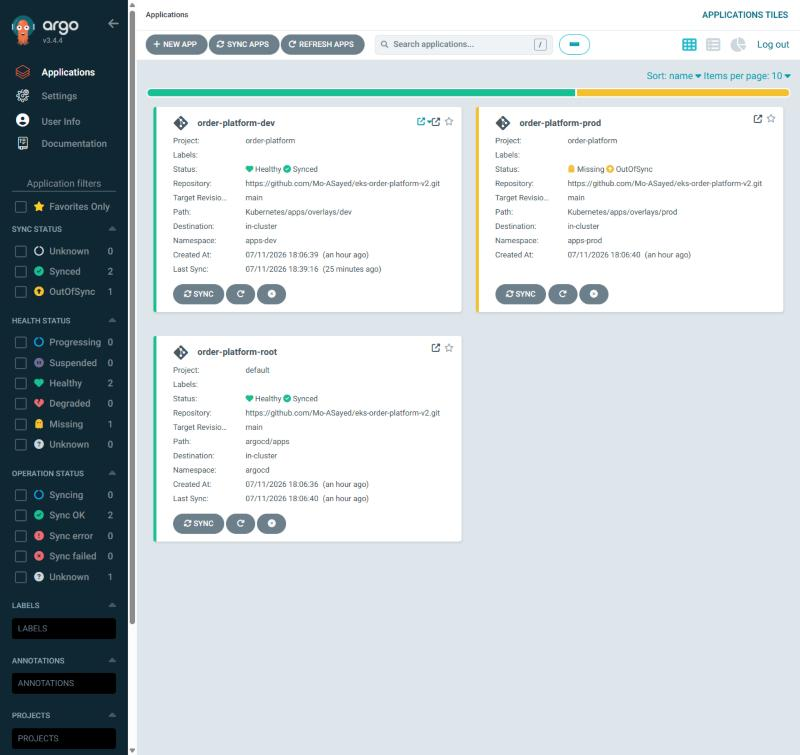
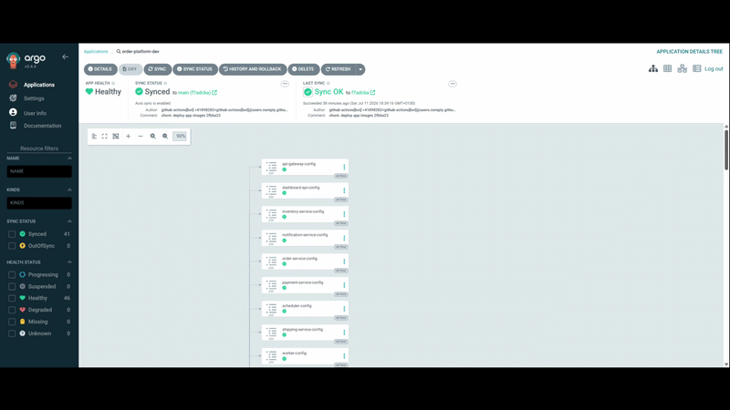
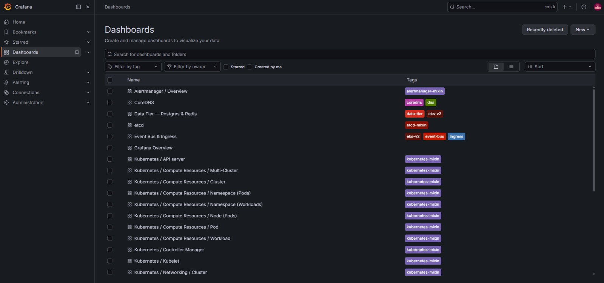
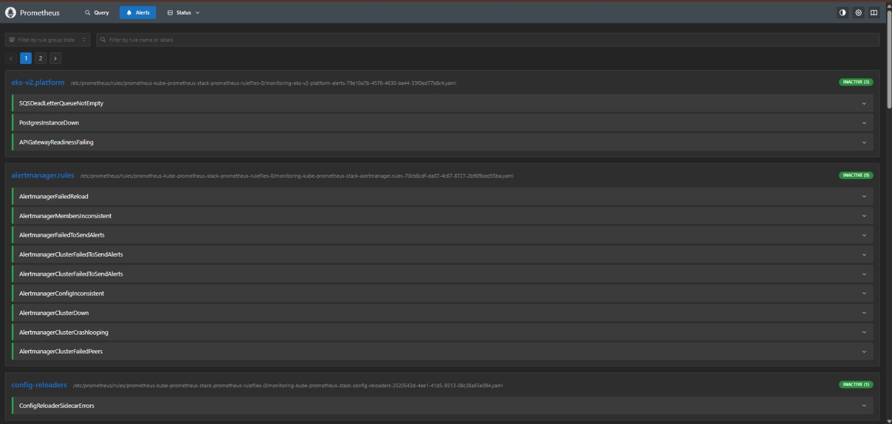

# Order Fulfilment Platform on Amazon EKS

A production-grade Kubernetes platform running nine Go microservices on Amazon EKS. Terraform provisions the AWS infrastructure and cluster add-ons, ArgoCD delivers the applications through GitOps, and GitHub Actions builds and ships every change. The whole platform stands up from nothing in about thirty minutes and tears down at the end of the day.

**Live at** `https://app.lab.mohammedsayed.com`

---

## Overview

The system is split into two layers, each with its own tool so neither trips over the other.

| Layer | Managed by | Contents |
|---|---|---|
| **Platform** | Terraform + Helm | VPC, EKS, Karpenter, Traefik, cert-manager, ExternalDNS, External Secrets, Postgres, Redis, SQS, Prometheus + Grafana |
| **Applications** | ArgoCD + Kustomize | The nine services, their Deployments, Services, config and secrets |



---

## Repository structure

Infrastructure, Kubernetes manifests and pipelines stay separate so provisioning, delivery and application config can each change on their own.

```
eks-order-platform-v2/
├── terraform/                    # infrastructure, the platform layer
│   ├── bootstrap/                #   one-off S3 bucket for remote state
│   ├── modules/
│   │   ├── vpc/                  #   network across 3 AZs, single NAT in dev
│   │   ├── eks/                  #   cluster, node IAM, access entries
│   │   ├── karpenter/            #   node autoscaling + NodePool
│   │   ├── platform-addons/      #   Traefik, cert-manager, ExternalDNS, External
│   │   │                         #     Secrets, EBS CSI, ArgoCD, storage classes
│   │   ├── stateful-tier/        #   CloudNativePG Postgres + Redis, generated secrets
│   │   ├── eventbus/             #   SQS queue + DLQ, IRSA policies
│   │   ├── observability/        #   kube-prometheus-stack, dashboards, alerts, YACE
│   │   ├── dns/                  #   Route 53 zone
│   │   └── github-actions/       #   OIDC provider + CI/CD roles
│   └── envs/dev/                 #   the live environment, wires the modules together
│
├── Kubernetes/apps/
│   ├── base/                     # nine services as Kustomize bases
│   │   ├── api-gateway/   order-service/    inventory-service/
│   │   ├── payment-service/   shipping-service/   notification-service/
│   │   └── dashboard-api/   worker/   scheduler/
│   └── overlays/
│       ├── dev/                  #   namespace, host, image tags, replicas
│       └── prod/
│
├── argocd/
│   ├── bootstrap/root.yaml       # the "app of apps" root Application
│   └── apps/                     #   AppProject + dev and prod Applications
│
├── services/                     # Go source, Dockerfiles, per-service values
│   ├── api-gateway/   order-service/   inventory-service/   payment-service/
│   ├── shipping-service/   notification-service/   dashboard-api/
│   └── worker/   scheduler/
│
├── scripts/                      # localstack init + pipeline helpers
└── .github/workflows/            # ci, app-cd, infra-cd, infra-destroy
```

---

## Tech stack

| Category | Technology |
|---|---|
| Cloud | AWS (eu-west-2) |
| Infrastructure as Code | Terraform |
| Orchestration | Kubernetes (Amazon EKS) |
| Node autoscaling | Karpenter |
| Pod autoscaling | HorizontalPodAutoscaler on CPU, backed by metrics-server |
| GitOps | ArgoCD |
| CI/CD | GitHub Actions (OIDC, no static keys) |
| Container registry | Amazon ECR |
| App manifests | Kustomize (base plus dev and prod overlays) |
| Ingress | Traefik behind a Network Load Balancer |
| DNS | Route 53 and ExternalDNS |
| TLS | cert-manager and Let's Encrypt |
| Secrets | AWS Secrets Manager and External Secrets Operator |
| Database | PostgreSQL, in-cluster via CloudNativePG |
| Cache | Redis, in-cluster |
| Event bus | Amazon SQS with a dead-letter queue |
| Observability | Prometheus and Grafana |
| Image scanning | Trivy |

---

## The services

Nine small Go services take orders, check stock, take payment, arrange shipping, send notifications and present a dashboard.

| Service | Port | Responsibility | Talks to |
|---|---|---|---|
| **api-gateway** | 8080 | Public entry point, auth, rate limiting | All services, Redis |
| **order-service** | 8081 | Creates and tracks orders | Postgres, SQS (publish) |
| **inventory-service** | 8082 | Stock levels | Postgres |
| **payment-service** | 8083 | Takes payment | Postgres, SQS (publish) |
| **notification-service** | 8084 | Sends notifications | Postgres |
| **shipping-service** | 8085 | Arranges shipping | Postgres, SQS (publish) |
| **dashboard-api** | 8086 | Serves the dashboard and UI | Postgres |
| **worker** | 8090 | Consumes the queue, calls services back | SQS (consume) |
| **scheduler** | 8091 | Periodic jobs | Postgres |

**How they communicate**

* **North to south.** The api-gateway serves `/api` and `/auth`. The dashboard-api serves `/dashboard` and `/`.
* **East to west (sync).** The gateway fans out to services over REST by cluster DNS, for example `http://order-service:8081`. Each service reads and writes Postgres, and the gateway uses Redis.
* **Async.** Order, payment and shipping publish events to SQS. The worker consumes them and calls the relevant services back over REST. A dead-letter queue catches anything that fails four times.

Only the SQS producers and the worker hold AWS permissions, granted through IRSA rather than keys. Every service runs as non-root with a read-only root filesystem and CPU and memory limits set.

---

## Request flow

```
User
  │
  ▼
Route 53          resolves app.lab.mohammedsayed.com
  │
  ▼
NLB               internet-facing, public subnets
  │
  ▼
Traefik           terminates TLS, redirects HTTP to HTTPS
  │
  ▼
Ingress           path rules
  │
  ├─►  /api  /auth          api-gateway   (:8080)
  └─►  /dashboard  /        dashboard-api (:8086)
```

DNS records are created automatically by ExternalDNS and certificates are issued and renewed automatically by cert-manager, so a new hostname becomes a working HTTPS URL with no manual steps.

**Live operations dashboard.** Orders moving through the full lifecycle (cancelled, confirmed, processing, shipped), with the revenue and active-shipment counters.



**Service health.** All nine services reporting healthy, grouped by domain.



---

## How a change ships

Two pipelines, split by which paths changed. A change under `terraform/` is infrastructure, a change under `services/` is an app. Kubernetes manifests are validated in CI but only ArgoCD ever applies them.



* **On a PR** nothing touches AWS. The checks run with no cloud credentials.
* **App change on merge.** App CD builds and Trivy-scans an image for each changed service, pushes it to ECR, then bumps that service's tag in the `dev` overlay and commits it. ArgoCD sees the commit and rolls out only the affected service.
* **Infra change on merge.** Infra CD scans first, then waits on a GitHub environment approval, so a push never changes cloud state until someone signs it off.
* **No static keys.** GitHub Actions authenticates over OIDC, assuming a role whose trust policy is locked to this repository. Dev auto-syncs, prod is a manual sync in the ArgoCD UI.

The App-of-Apps root fans out to the `dev` and `prod` Applications, and each service's manifests, config and workloads sync from Git.





---

## Platform capabilities

**Secrets**

* AWS Secrets Manager holds every secret. Terraform writes the Postgres, Redis and JWT values into it.
* The External Secrets Operator syncs them into pods over IRSA, so nothing sensitive lives in Git.
* To rotate, change the value in Secrets Manager. The operator refreshes it within an hour, then a `kubectl rollout restart` loads it with no downtime.

**Storage and backups**

* Postgres and Redis use encrypted gp3 EBS volumes on a `gp3-retain` storage class, so an accidental `kubectl delete` leaves the data intact.
* Backups are real EBS snapshots through the CSI snapshot controller, and the restore path is tested end to end.
* Point-in-time recovery falls back to CloudNativePG's `Backup` CRD with WAL archiving to S3.

<details>
<summary><b>Restore drill</b> (snapshot the live PVC, recover into a new cluster, verify the row survived)</summary>

```bash
# snapshot the live Postgres PVC
kubectl apply -f - <<'EOF'
apiVersion: snapshot.storage.k8s.io/v1
kind: VolumeSnapshot
metadata: {name: pg-restore-test, namespace: data}
spec:
  volumeSnapshotClassName: ebs-csi-snapshot-class
  source: {persistentVolumeClaimName: postgres-1}
EOF

# recover into a fresh cluster straight from the snapshot
kubectl apply -f - <<'EOF'
apiVersion: postgresql.cnpg.io/v1
kind: Cluster
metadata: {name: postgres-restore, namespace: data}
spec:
  instances: 1
  imageName: ghcr.io/cloudnative-pg/postgresql:16
  storage: {storageClass: gp3-retain, size: 20Gi}
  bootstrap:
    recovery:
      volumeSnapshots:
        storage: {name: pg-restore-test, kind: VolumeSnapshot, apiGroup: snapshot.storage.k8s.io}
EOF

# the known row survived the snapshot to restore
kubectl exec -n data postgres-restore-1 -- psql -U postgres -d app -c "SELECT * FROM restore_test;"
#  RESTORE-TEST | snapshot proof | 2026-07-11 18:30:48+00
```

</details>

**Scaling**

* Karpenter adds right-sized nodes in seconds and consolidates them when load drops.
* api-gateway and dashboard-api autoscale on CPU with a `HorizontalPodAutoscaler` at a 70% target (fed by metrics-server), from one replica in dev or two in prod up to four.
* Everything else runs a single replica. The data tier stays fixed because a single-writer Postgres gains nothing from scaling sideways.

---

## Database migrations

Seven services share one Postgres instance, and each owns its own tables. On startup each service runs a `migrate()` step of idempotent `CREATE TABLE IF NOT EXISTS` and `CREATE INDEX IF NOT EXISTS` statements, so there is no shared migration job to coordinate. Because the statements are additive, rollouts and rollbacks are both safe, and adding a nullable column or index needs no downtime. A destructive change such as renaming a column is done over two releases, adding the new shape and moving readers across before dropping the old one.

---

## Observability

kube-prometheus-stack runs Prometheus and Grafana, and a CloudWatch exporter (YACE) brings SQS queue depth in alongside the cluster metrics. Three alerts are worth waking someone for. The dead-letter queue is non-empty, Postgres is down, or the api-gateway is failing readiness.

**Grafana** dashboards grouped by service.



**Prometheus alerts** for DLQ depth, Postgres down, and gateway readiness.



Other views, [scrape targets healthy](images/prometheus-targets-healthy-1.jpeg), [node compute resources](images/grafana-node-compute-resources.jpeg), and [cluster networking](images/grafana-cluster-networking.jpeg).

---

## Key decisions

| Decision | Why |
|---|---|
| Postgres in-cluster (CloudNativePG), not RDS | Keeps the stateful tier under the same GitOps and IRSA model as everything else. The operator owns the pod, PVC, bootstrap and snapshots, so there is no separate database lifecycle to run beside the cluster. |
| SQS, not Kafka | The services already speak SQS, so it is zero application change for a managed queue and DLQ, and nothing to operate. |
| Karpenter, not Cluster Autoscaler | Right-sized nodes in seconds with bin-packing and consolidation, instead of fixed node groups sized for peak. |
| Kustomize for apps, Helm for platform | Plain YAML overlays that ArgoCD reads natively. Helm is kept for the big upstream charts that expect it. |
| OIDC for CI, no static keys | GitHub Actions assumes a short-lived role scoped to this repository, with nothing long-lived to leak or rotate. |

---

## Security

* Worker nodes and application pods run in private subnets with no direct public access.
* HTTPS only, with certificates issued and renewed automatically by cert-manager.
* Secrets held in AWS Secrets Manager and synced in by the External Secrets Operator.
* Pods reach AWS through IRSA roles scoped to least privilege, never static keys.
* CI authenticates over OIDC with a role trust policy locked to this repository.
* Containers run non-root with a read-only root filesystem and all Linux capabilities dropped.
* Postgres and Redis are isolated in-cluster with encrypted volumes.

---

## Rebuild and teardown

The platform is meant to be disposable. `terraform apply` builds it, ArgoCD syncs the apps onto it, and you have a working cluster in about thirty minutes. `terraform destroy` removes it again. Cost discipline is built in, a single NAT gateway in dev, Karpenter consolidating nodes, and nightly teardown so nothing bills overnight.
